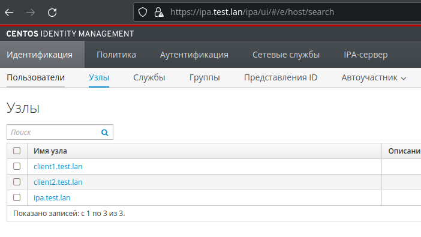
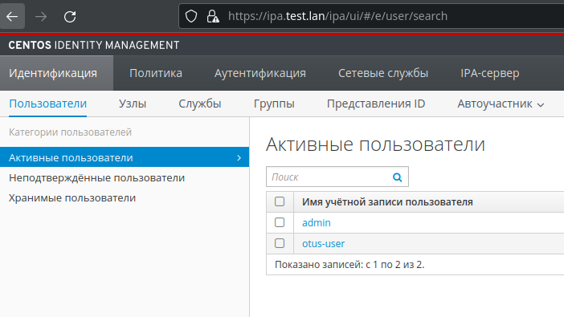

# LDAP 

1. При  помощи vagrant запустил 3 виртуальных машины
    - ipa.test.lan
    - client1.test.lan
    - client2.test.lan
2. При помощи ansible развернул ipa server на ipa.test.lan
3. Подключил клиентов к домену 
4. Создал пользователя otus-user  и авторизовался на клиентах
